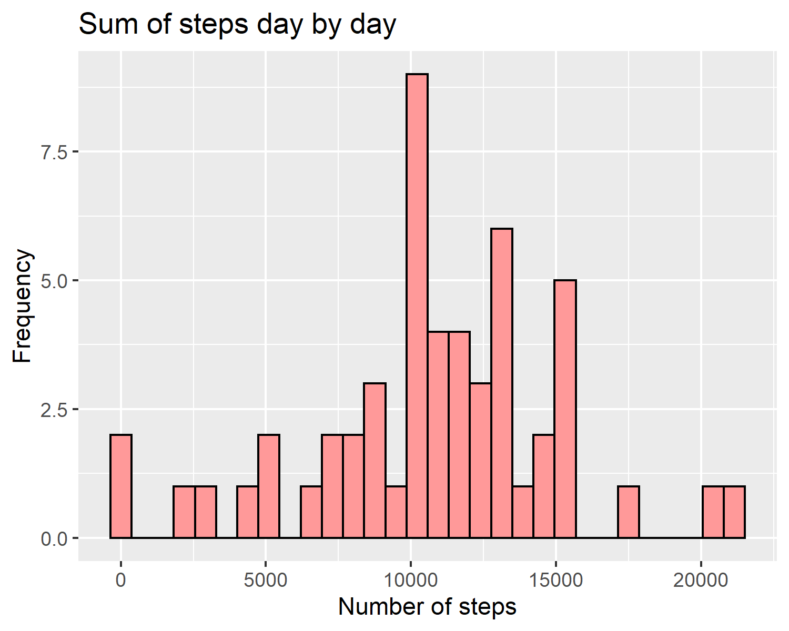

```r
if(!require(tidyverse)) install.packages('tidyverse', 
repos = 'http://cran.us.r-project.org')
if(!require(lattice)) install.packages('lattice', 
repos = 'http://cran.us.r-project.org')
## specify global chunk options
knitr::opts_chunk$set(fig.width = 5, fig.height = 4, dpi = 300,
                      out.width = '90%', fig.align = 'center',
                      tidy.opts=list(width.cutoff=60),
                      tidy=TRUE,
                      cache = TRUE,
                      message = FALSE,
                      warning = FALSE)
```
## Introduction

It is now possible to collect a large amount of data about personal movement using activity monitoring devices such as a Fitbit, Nike Fuelband, or Jawbone Up. These type of devices are part of the “quantified self” movement – a group of enthusiasts who take measurements about themselves regularly to improve their health, to find patterns in their behavior, or because they are tech geeks. But these data remain under-utilized both because the raw data are hard to obtain and there is a lack of statistical methods and software for processing and interpreting the data.

This assignment makes use of data from a personal activity monitoring device. This device collects data at 5 minute intervals through out the day. The data consists of two months of data from an anonymous individual collected during the months of October and November, 2012 and include the number of steps taken in 5 minute intervals each day.

The data for this assignment can be downloaded from the course web site:

Dataset: [Activity monitoring data [52K]](https://d396qusza40orc.cloudfront.net/repdata%2Fdata%2Factivity.zip)

The variables included in this dataset are:

**steps:** Number of steps taking in a 5-minute interval (missing values are coded as \color{red}{\verb|NA|}NA)

**date:** The date on which the measurement was taken in YYYY-MM-DD format

**interval:** Identifier for the 5-minute interval in which measurement was taken

The dataset is stored in a comma-separated-value (CSV) file and there are a total of 17,568 observations in this dataset.

## Loading and preprocessing the data

Let's start with data download.  We copy link used in project description and assign it to **fileurl**.


```r
# We copy link used in project description and assign it to
# fileurl
filename <- "repdata_data_activity.zip"
# Controll for already existing files If folder doesn't exist
# proceed with download
if (!file.exists(filename)) {
    fileURL <- "https://d396qusza40orc.cloudfront.net/repdata%2Fdata%2Factivity.zip"
    download.file(fileURL, filename, method = "curl")
}
# If file exists proceed with unzip
if (!file.exists("Source_Classification_Code.rds")) {
    unzip(filename)
}
if (!file.exists("activity.csv")) {
    unzip(filename)
}
```

Now we load our downloaded data:


```r
# Read activity.csv
activity <- read.csv("activity.csv", header = TRUE, sep = ",", 
    na.strings = "NA")
```

Let's see how are data look like:


```r
# A first look to data
head(activity)
```

```
##   steps       date interval
## 1    NA 2012-10-01        0
## 2    NA 2012-10-01        5
## 3    NA 2012-10-01       10
## 4    NA 2012-10-01       15
## 5    NA 2012-10-01       20
## 6    NA 2012-10-01       25
```

```r
# Let's check structure of dataframe
glimpse(activity)
```

```
## Observations: 17,568
## Variables: 3
## $ steps    <int> NA, NA, NA, NA, NA, NA, NA, NA, NA, NA, NA, NA, NA, NA, NA...
## $ date     <fct> 2012-10-01, 2012-10-01, 2012-10-01, 2012-10-01, 2012-10-01...
## $ interval <int> 0, 5, 10, 15, 20, 25, 30, 35, 40, 45, 50, 55, 100, 105, 11...
```

```r
# Lets the class for every variable
```

Next step is to understand variable type and check for missing values:


```r
# Let's check for the number of missing values
sum(is.na(activity))
```

```
## [1] 2304
```

```r
# We check classes of every column inside activity
lapply(activity, class)
```

```
## $steps
## [1] "integer"
## 
## $date
## [1] "factor"
## 
## $interval
## [1] "integer"
```

We see that variable **date** is of class **factor** and **interval** is of class **integer**. Let's convert **date** to class **Date** and **interval** to class **factor**


```r
# Let's convert variable date
activity$date <- as.Date(activity$date, format = "%Y-%m-%d")
# Let's convert variable interval
activityinterval <- factor(activity$interval)
```


## What is mean total number of steps taken per day?

Next we want to build histogram of the total number of steps taken each day. Before plotting we need to aggregrate steps for each day.


```r
# Aggregrate steps for each day
daysteps <- aggregate(steps ~ date, activity, sum)
# Plot histogram with NAs removed
ggplot(data = daysteps, aes(x = steps, fill = steps, na.rm = TRUE)) + 
    geom_histogram(stat = "bin", na.rm = TRUE, fill = "#FF9999", 
        colour = "black") + ggtitle("Sum of steps day by day") + 
    xlab("Number of steps") + ylab("Frequency")
```



Now let's calculate mean and median number of steps taken each day


```r
# Calculate mean
steps_mean <- mean(daysteps$steps)
steps_mean
```

```
## [1] 10766.19
```

```r
# Calculate median
steps_med <- median(daysteps$steps)
steps_med
```

```
## [1] 10765
```

## What is the average daily activity pattern?

To answer question regarding average daily activity pattern lets first plot time series of the average number of steps taken. Again before plotting we will aggregrate to find mean of steps for each time interval


```r
# Aggregrate to find mean of steps for each time interval
intsteps <- aggregate(steps ~ interval, activity, mean)
# Plot time series of the average number of steps taken
ggplot(data = intsteps, aes(x = interval, y = steps, na.rm = TRUE)) + 
    geom_line(colour = "red") + ggtitle("Time Series of Average Number of steps taken") + 
    xlab("Time intervals") + ylab("Steps Number")
```


Now we have to find the 5-minute interval that, on average, contains the maximum number of steps.


```r
# Which is max number of steps
max <- max(intsteps$steps)
max
```

```
## [1] 206.1698
```

```r
# The 5-minute interval that, on average, contains the
# maximum number of steps
int_max <- intsteps[which.max(intsteps$steps), ]$interval
int_max
```

```
## [1] 835
```
We see that 5-minute interval that, on average, contains the maximum number of steps ( 206.16 steps ) is the interval 835.


## Imputing missing values

Above we calculated number of missing values in dataset which is **2304**. Now let's calculate number of NAs for each variable


```r
# Which is number of NAs for each variable
sapply(activity, function(x) sum(is.na(x)))
```

```
##    steps     date interval 
##     2304        0        0
```

We see that only variable **steps** has missing values.

One strategy we can follow to fill the missing values is to replace them by the mean of corrensponding 5-minute interval.


```r
# First we create a copy of our dataset
miss_activity <- activity
# Replace missing values
activity_imp <- transform(miss_activity, steps = ifelse(is.na(steps), 
    ave(steps, interval, FUN = function(x) mean(x, na.rm = TRUE)), 
    steps))
```

Now we want to plot histogram of the total number of steps taken each day after missing values are imputed
For this we need again aggregration to find sum of steps for each time interval using the new dataset **activity_imp**


```r
# Aggregration to find sum of steps for each time interval
daysteps_new <- aggregate(steps ~ date, activity_imp, sum)
# Plot histogram
ggplot(data = daysteps_new, aes(x = steps, fill = steps, na.rm = TRUE)) + 
    geom_histogram(stat = "bin", na.rm = TRUE, fill = "red", 
        colour = "black") + ggtitle("Steps day by day after imputation") + 
    xlab("Number of steps") + ylab("Frequency")
```


Let's calculate again **mean** and **median** number of steps taken each day after imputation


```r
# Calculate mean
imp_steps_mean <- mean(daysteps_new$steps)
imp_steps_mean
```

```
## [1] 10766.19
```

```r
# Calculate median
imp_steps_med <- median(daysteps_new$steps)
imp_steps_med
```

```
## [1] 10766.19
```

As we already expected **mean** of original dataset is equal to **mean** of the dataset after imputation 10766.19. 

**Median** of original dataset has changed slightly from 10765 to 10766 so we can say that both these characteristics are equal for both datasets. We notice missing data mostly affect 10000 - 150000 step interval.

## Are there differences in activity patterns between weekdays and weekends?

For this part the \color{red}{\verb|weekdays()|}weekdays() function may be of some help here. We will use the dataset with the filled-in missing values for this part.

First we will create a new factor variable in the dataset with two levels – **weekday** and **weekend** indicating whether a given date is a weekday or weekend day.

Make a panel plot containing a time series plot (i.e. \color{red}{\verb|type = "l"|}type="l") of the 5-minute interval (x-axis) and the average number of steps taken, averaged across all weekday days or weekend days (y-axis). 


```r
# Vector weekdays
weekdays <- c("Monday", "Tuesday", "Wednesday", "Thursday", "Friday")
# Create new factor week_factor
activity_imp$week_factor = as.factor(ifelse(is.element(weekdays(as.Date(activity_imp$date)), 
    weekdays), "Weekday", "Weekend"))
# Check week_days
levels(activity_imp$week_factor)
```

```
## [1] "Weekday" "Weekend"
```

Now lets create the panel plot


```r
# Aggregation to compute average number of steps taken by
# week_factor
wf_intsteps <- aggregate(steps ~ interval + week_factor, activity_imp, 
    mean)
# Panel plot
xyplot(wf_intsteps$steps ~ wf_intsteps$interval | wf_intsteps$week_factor, 
    main = "Average number of steps (weekdays/weekend)", xlab = "Time Intervals", 
    ylab = "Steps", layout = c(1, 2), type = "l")
```


